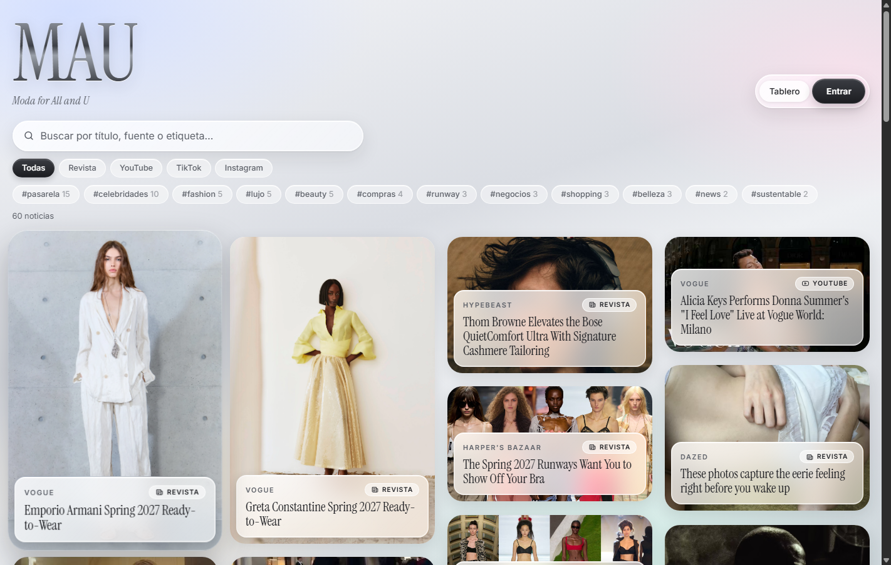
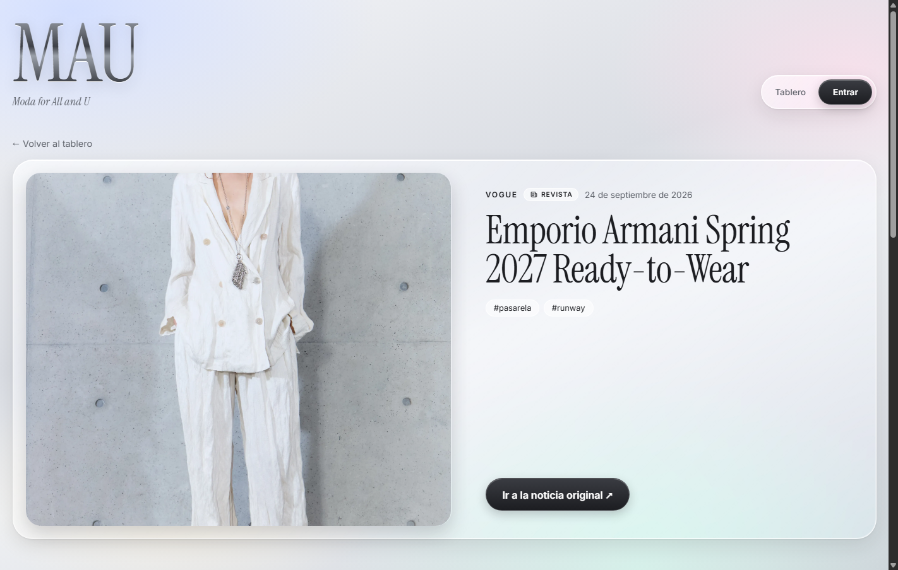
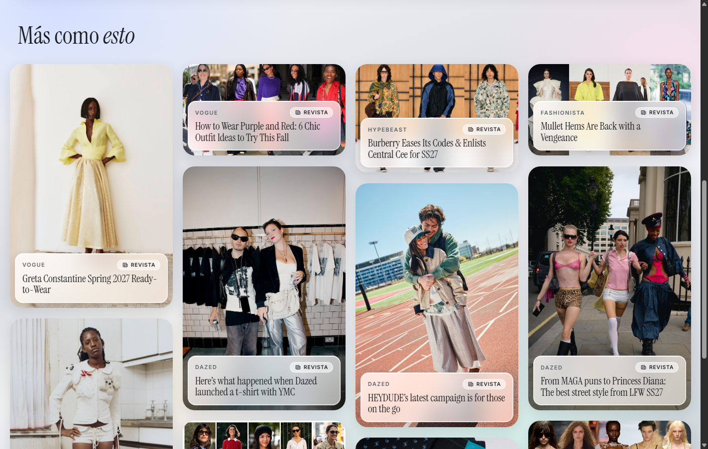

# 🪩 Diseño: plata y vidrio líquido

Nueva identidad visual de MAU y las interacciones del tablero.

---

## 1. Identidad visual

| Elemento | Decisión |
|---|---|
| **Fondo** | Plata cromada clara con reflejos perlados (azul hielo, rosa, menta y champaña). Es una capa fija para que el vidrio tenga algo que refractar |
| **Superficies** | Vidrio líquido: blanco translúcido con desenfoque (`backdrop-filter: blur + saturate`), borde de luz y brillo interior arriba |
| **Logo** | "MAU" en letras de plata cromada (degradado metálico recortado al texto) |
| **Tipografía** | *Instrument Serif* para títulos, en estilo editorial de revista, e *Inter* para textos. Van empaquetadas con la app porque la política de seguridad no permite cargar fuentes externas |
| **Botones** | Grafito metálico con brillo; los secundarios, de vidrio |
| **Íconos** | Íconos de línea propios para Revista, YouTube, TikTok e Instagram, en lugar de emojis |

Todos los valores viven como variables en [`src/styles/variables.css`](../src/styles/variables.css) (`--glass-bg`, `--glass-blur`, `--chrome`, `--ease-elastic`…). La clase `.glass` de [`index.css`](../src/index.css) aplica el vidrio a cualquier elemento.

---

## 2. Tarjetas de noticias

- La **foto ocupa toda la tarjeta**; la fuente, la plataforma y el título van en un **panel de vidrio** encima, que desenfoca la foto de fondo.
- El título se corta a 3 líneas para que el mosaico se vea parejo.

### Pop elástico al pasar el mouse

La tarjeta crece y **se deforma como gelatina** antes de quedarse más grande, sin perder su forma:

| Momento | Escala (ancho × alto) | Esquinas |
|---|---|---|
| 0 % | 1.00 × 1.00 | 24 px |
| 22 % | 1.10 × 0.94, se estira a lo ancho | irregulares |
| 42 % | 0.97 × 1.08, se estira a lo alto | irregulares |
| 62 % | 1.07 × 1.01, rebota | |
| 100 % | **1.045 × 1.045**, más grande y sin deformar | 30 px |

Además:
- Un **reflejo de luz** sigue al cursor. Se escribe directo en el estilo con variables CSS, sin hacer renders de React.
- La foto hace un pequeño zoom y el panel de vidrio sube un poco.
- La tarjeta queda **encima** de sus vecinas y proyecta una sombra más profunda.
- Con **"reducir movimiento"** activado en el sistema, solo crece un poco, sin rebote.

Medido en Chrome: durante el pop la tarjeta llega a deformarse **13 %** entre ancho y alto, y termina en **1.045 × 1.045**.

---

## 3. Clic, doble clic y la página de la noticia

| Acción | Resultado |
|---|---|
| **Un clic** | Abre la página de la noticia en MAU (`/noticia/:id`) |
| **Doble clic** | Abre la noticia original en una pestaña nueva |
| **Enter** con el teclado | Abre la página de la noticia |
| **Ctrl/Cmd + clic** | Abre la página de la noticia en otra pestaña (comportamiento normal de un enlace) |

Un doble clic también dispara dos clics. [`useClickOrDoubleClick`](../src/hooks/useClickOrDoubleClick.js) espera **250 ms** antes de ejecutar el clic sencillo; si llega el segundo clic, lo cancela y abre la fuente.

### Página de la noticia ([`NewsDetail.jsx`](../src/pages/NewsDetail.jsx))

- La noticia en grande, en un panel de vidrio: foto, fuente, plataforma, fecha, resumen y etiquetas.
- Botón **"Ir a la noticia original ↗"**.
- Abajo, **"Más como esto"**: hasta 12 noticias relacionadas, con las mismas tarjetas y el mismo pop.
- Se puede compartir el enlace directo de una noticia.

### Cómo se eligen las relacionadas ([`related.js`](../src/utils/related.js))

Cada noticia recibe un puntaje de parecido:

| Criterio | Puntos |
|---|---|
| Cada etiqueta en común (#pasarela, #lujo…) | **3** |
| Misma fuente (ej. las dos de Vogue) | 1 |
| Misma plataforma (ej. las dos son video) | 0.5 |

Se muestran las de mayor puntaje; las que suman 0 no se muestran. El cálculo se memoriza con `useMemo`.

---

## 4. Pruebas

| Prueba | Resultado |
|---|---|
| Pop: se deforma durante la animación | ✅ hasta 13 % |
| Pop: termina más grande y sin deformar | ✅ 1.045 × 1.045 |
| Doble clic abre la fuente original y no cambia de página | ✅ |
| Un clic abre la página de la noticia correcta | ✅ |
| El botón abre la fuente en una pestaña nueva | ✅ |
| Aparecen noticias relacionadas | ✅ 12 |
| El enlace directo a una noticia funciona | ✅ |
| Enter con el teclado abre la noticia | ✅ |
| Algoritmo de relacionadas (Vitest) | ✅ 4 pruebas |
| Pruebas de sprints anteriores (rutas, validaciones, filtros) | ✅ 12 + 19 + 10 |
| Build de producción con la política de seguridad | ✅ sin violaciones |

### Bug encontrado al probar

La página de la noticia usaba `useEffect(() => window.scrollTo({ behavior: 'smooth' }))`. En Chrome reciente, el scroll suave **regresa una Promise**, y React la tomaba como función de limpieza y fallaba. El `ErrorBoundary` lo contuvo, pero la página no se veía. Se corrigió escribiendo el efecto con llaves para que no regrese nada.
