# 🪩 Diseño: plata y vidrio líquido

Identidad visual de MAU y las interacciones del tablero. El resumen del sistema, en el formato de [awesome-design-md](https://github.com/voltagent/awesome-design-md), está en **[DESIGN.md](../DESIGN.md)**.

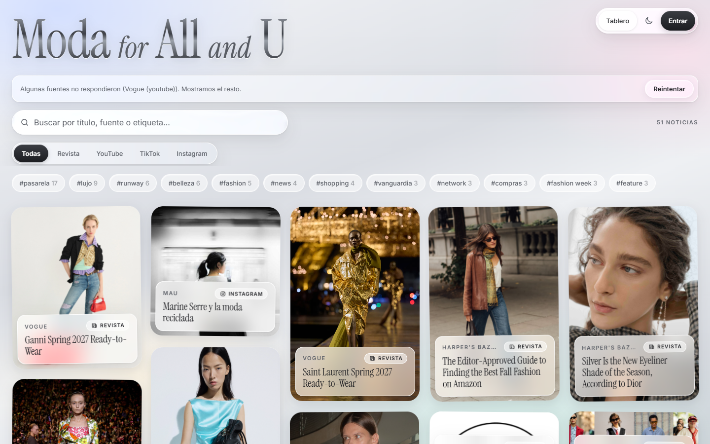

---

## 1. Identidad visual

| Elemento | Decisión |
|---|---|
| **Fondo** | Plata cromada clara con reflejos perlados (azul hielo, rosa, menta y champaña). Es una capa fija para que el vidrio tenga algo que refractar |
| **Superficies** | Vidrio: blanco translúcido con desenfoque (`backdrop-filter: blur + saturate`), borde de luz y brillo especular. Los controles que flotan sobre fotos además **refractan** el fondo (ver sección 6) |
| **Logo** | La leyenda completa, *Moda for All and U*, en plata cromada (degradado metálico recortado al texto). Los conectores *for* y *and* van en cursiva, más pequeños y en gris, para que resalten las iniciales **M·A·U**. Desde el Sprint 9 reemplaza al logo "MAU" con el lema abajo |
| **Tipografía** | *Instrument Serif* para títulos, en estilo editorial de revista, e *Inter* para textos. Van empaquetadas con la app porque la política de seguridad no permite cargar fuentes externas |
| **Botones** | Grafito metálico con brillo; los secundarios, de vidrio |
| **Íconos** | Íconos de línea propios para Revista, YouTube, TikTok e Instagram, en lugar de emojis |

Todos los valores viven como variables en [`src/styles/variables.css`](../src/styles/variables.css) (`--glass-bg`, `--glass-blur`, `--chrome`, `--ease-elastic`…). La clase `.glass` de [`index.css`](../src/index.css) aplica el vidrio a cualquier elemento. El ancho máximo del contenido es de **1,680 px**, para aprovechar pantallas grandes.

---

## 2. Tarjetas de noticias

- La **foto ocupa toda la tarjeta**; la fuente, la plataforma y el título van en un **panel de vidrio** encima, que desenfoca la foto de fondo.
- El título se corta a 3 líneas para que el mosaico se vea parejo.

### Pop elástico al pasar el mouse

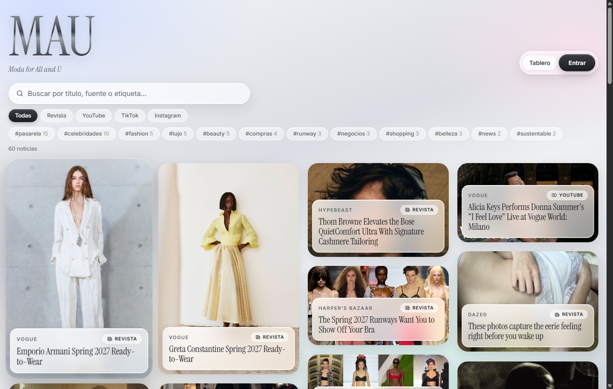

La tarjeta crece y **se deforma como gelatina** antes de quedarse más grande, sin perder su forma:

| Momento | Escala (ancho × alto) | Esquinas |
|---|---|---|
| 0 % | 1.00 × 1.00 | 24 px |
| 22 % | 1.10 × 0.94, se estira a lo ancho | irregulares |
| 42 % | 0.97 × 1.08, se estira a lo alto | irregulares |
| 62 % | 1.07 × 1.01, rebota | |
| 100 % | **1.045 × 1.045**, más grande y sin deformar | 30 px |

Además:
- Un **reflejo de luz** sigue al cursor. Se escribe directo en el estilo con variables CSS, sin hacer renders de React.
- La foto hace un pequeño zoom y el panel de vidrio sube un poco.
- La tarjeta queda **encima** de sus vecinas y proyecta una sombra más profunda.
- Con **"reducir movimiento"** activado en el sistema, solo crece un poco, sin rebote.

Medido en Chrome: durante el pop la tarjeta llega a deformarse **13 %** entre ancho y alto, y termina en **1.045 × 1.045**.

---

## 3. Clic, doble clic y la página de la noticia

| Acción | Resultado |
|---|---|
| **Un clic** | Abre la página de la noticia en MAU (`/noticia/:id`) |
| **Doble clic** | Abre la noticia original en una pestaña nueva |
| **Enter** con el teclado | Abre la página de la noticia |
| **Ctrl/Cmd + clic** | Abre la página de la noticia en otra pestaña (comportamiento normal de un enlace) |

Un doble clic también dispara dos clics. [`useClickOrDoubleClick`](../src/hooks/useClickOrDoubleClick.js) espera **250 ms** antes de ejecutar el clic sencillo; si llega el segundo clic, lo cancela y abre la fuente.

### Página de la noticia ([`NewsDetail.jsx`](../src/pages/NewsDetail.jsx))

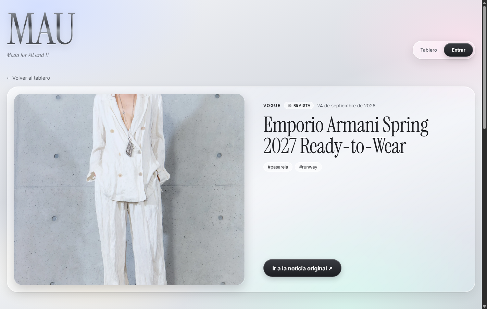

- La noticia en grande, en un panel de vidrio: foto, fuente, plataforma, fecha, resumen y etiquetas.
- Botón **"Ir a la noticia original ↗"**.
- Abajo, **"Más como esto"**: hasta 12 noticias relacionadas, con las mismas tarjetas y el mismo pop.
- Se puede compartir el enlace directo de una noticia.

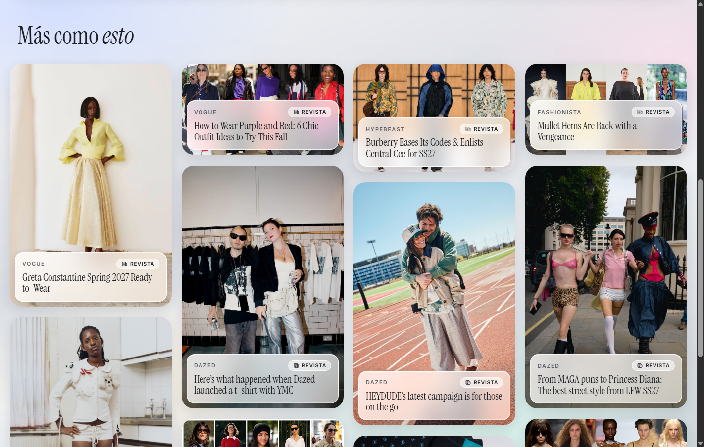

### Cómo se eligen las relacionadas ([`related.js`](../src/utils/related.js))

Cada noticia recibe un puntaje de parecido:

| Criterio | Puntos |
|---|---|
| Cada etiqueta en común (#pasarela, #lujo…) | **3** |
| Misma fuente (ej. las dos de Vogue) | 1 |
| Misma plataforma (ej. las dos son video) | 0.5 |

Se muestran las de mayor puntaje; las que suman 0 no se muestran. El cálculo se memoriza con `useMemo`.

---

## 4. Modo oscuro (Sprint 9)

Grafito profundo con plata y **vidrio ahumado**. El botón de sol/luna del header ([`ThemeToggle`](../src/components/ThemeToggle.jsx)) cambia entre claro y oscuro.

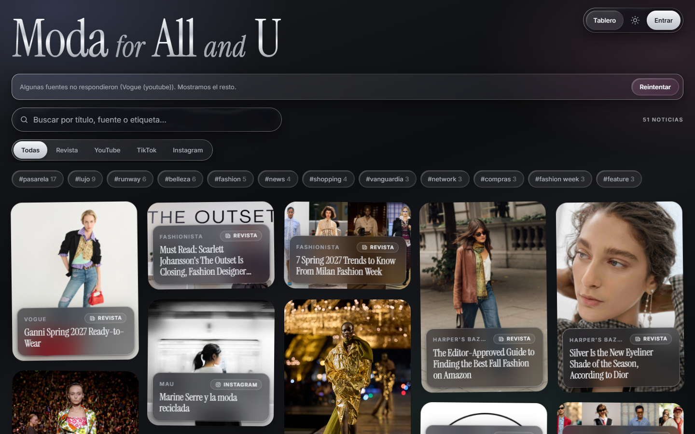

| Situación | Tema que se ve |
|---|---|
| El usuario nunca eligió | El del sistema (`prefers-color-scheme`) |
| El usuario eligió con el botón | Su elección, guardada en `localStorage` (`mau.theme`) |
| Sin `localStorage` (modo privado estricto) | La elección dura hasta recargar |

**Cómo funciona:**

- Todos los colores que cambian son variables en [`variables.css`](../src/styles/variables.css): `--surface-1`, `--surface-2`, `--highlight`, `--shadow-rgb`, `--backdrop`, `--card-placeholder`, `--alert-*`… Los componentes ya no tienen blancos ni sombras fijas.
- El tema oscuro se define **una sola vez**, en `:root[data-theme='dark']`. Desde el Sprint 10, [`public/theme-init.js`](../public/theme-init.js) siempre pone `data-theme` en `<html>`: la elección guardada o, si no hay, la del sistema. Antes los valores oscuros se repetían en un `@media (prefers-color-scheme: dark)`.
- [`useTheme`](../src/hooks/useTheme.js) cambia el atributo `data-theme` de `<html>` y guarda la elección. Mientras el usuario no elija, también sigue los cambios del sistema con la app abierta.
- `theme-init.js` se ejecuta **antes de que se pinte la página**, para evitar un destello del tema equivocado. Es un archivo aparte y no un `<script>` en línea porque la CSP (`script-src 'self'`) solo permite scripts propios.
- `index.html` declara `theme-color` para claro y oscuro, así la barra del navegador en el celular combina con el tema.

---

## 5. Scroll infinito (Sprint 9)

- El tablero abre con las 6 fuentes principales y, al acercarse al final, pide más revistas por tandas: primero Elle y Glamour, luego Esquire y Cosmopolitan.
- [`LoadMore`](../src/components/LoadMore.jsx) está al final del tablero: muestra *"Cargando más noticias…"* con un indicador giratorio, un error con **Reintentar**, o al terminar *"✦ Ya viste todas las noticias de hoy ✦"* con un botón **Volver arriba**.
- Las tarjetas nuevas se agregan al final; las que ya estaban no se mueven ni se vuelven a dibujar.
- Los filtros y el buscador aplican también a las noticias nuevas.
- Si se abre el enlace de una noticia que está en una tanda posterior, la página sigue pidiendo tandas hasta encontrarla.

Detalle técnico y cifras en [OPTIMIZACION.md](OPTIMIZACION.md#scroll-infinito-pedir-menos-al-inicio-sprint-9).

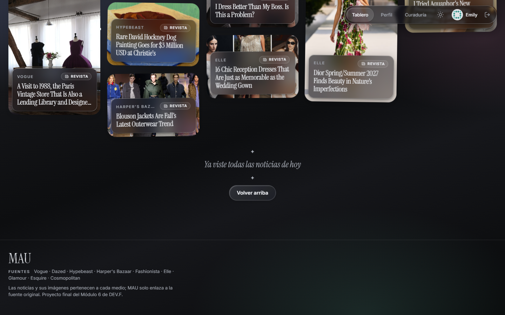

---

## 6. Sprint 10: diseño con referencias y vidrio líquido

El diseño se pulió con dos repositorios de referencia, **sin cambiar la identidad** (plata, vidrio, Instrument Serif y pop elástico).

### Qué se tomó de cada referencia

| Referencia | Idea | Cómo quedó en MAU |
|---|---|---|
| [awesome-design-md](https://github.com/voltagent/awesome-design-md) · **Apple** | La interfaz se aparta para que luzca la foto; vidrio sobre la fotografía | Navegación en una cápsula de vidrio que flota siempre visible |
| Apple | Área de toque mínima de 44 px y presión `scale(0.95)` | Botones, pestañas, chips y segmentos |
| Apple | Lectura a 17 px con interlineado 1.47 y títulos con tracking negativo | Resumen de la noticia y títulos (`--text-body`, `--tracking-display`) |
| **Pinterest** | La foto es la tarjeta; el número de columnas cambia con el ancho | 2 columnas en el celular y hasta 6 en pantallas anchas |
| Pinterest | Tira de filtros que se desliza y radios de 16/32/píldora | Etiquetas deslizables en el celular; radios `--radius-sm/-lg/-pill` |
| **Wired** | Voz de revista: etiqueta pequeña en mayúsculas y líneas finas como separadores | Clase `.eyebrow` (fuente, fecha, conteo) y líneas en la página de la noticia |
| Todas | Un sistema escrito en un DESIGN.md | [`DESIGN.md`](../DESIGN.md) en la raíz del repositorio |
| [awesome-liquid-glass](https://github.com/carolhsiaoo/awesome-liquid-glass) | Capas de tinte, brillo y refracción con filtros SVG | Vidrio en tres capas y refracción `#mau-liquid` (abajo) |

### Vidrio líquido: tres capas

Basado en [liquid-glass-effect-macos](https://github.com/lucasromerodb/liquid-glass-effect-macos) y [shuding/liquid-glass](https://github.com/shuding/liquid-glass):

| Capa | Qué hace |
|---|---|
| El elemento (`.glass`) | Tinte translúcido y **brillo especular**: sombras interiores claras arriba a la izquierda y abajo a la derecha |
| `::before` | Desenfoca y satura el fondo (`backdrop-filter`). Con `.glass--liquid` además lo **refracta** con `filter: url(#mau-liquid)` |
| `::after` | **Borde de luz** que se desvanece en diagonal, como el canto de un cristal (máscara `mask-composite: exclude`) |

El filtro [`LiquidGlassFilter`](../src/components/LiquidGlassFilter.jsx) se dibuja una vez: `feTurbulence` genera un ruido suave, `feGaussianBlur` lo alisa y `feDisplacementMap` mueve los píxeles del fondo según ese ruido.

| Claro | Oscuro |
|---|---|
| 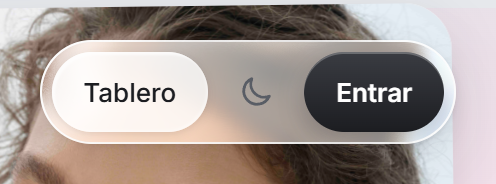 | 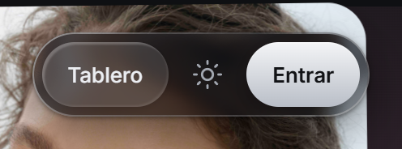 |

**Dónde se usa:** cápsula de navegación, buscador, "Volver al tablero" y el panel de una tarjeta **solo mientras hace el pop**. No se pone en todas las tarjetas porque el filtro cuesta.

**Compatibilidad:** solo Chromium (Chrome, Edge, Opera) dibuja bien un filtro SVG sobre una capa con `backdrop-filter`; en Safari y Firefox ese filtro borra el desenfoque. [`theme-init.js`](../public/theme-init.js) agrega la clase `liquid-refraction` solo si existe `navigator.userAgentData` (exclusivo de Chromium). En los demás navegadores se ve el vidrio esmerilado de siempre.

**Accesibilidad:** con *reducir transparencia* activado en el sistema (`prefers-reduced-transparency`), las superficies se vuelven sólidas.

### Detalles técnicos que se aprendieron

- **El desenfoque va en `::before`, no en el elemento.** Un elemento con `backdrop-filter`, `filter`, `opacity` o `mask` es un *backdrop root*: el vidrio que tiene adentro ya no ve la página, solo a su contenedor. Por eso la tira de la plataforma no lleva la máscara de desvanecido y las animaciones de la noticia y de los avisos no usan opacidad.
- **Mucho desenfoque borra la refracción.** Con `blur(20px)` el filtro cambiaba solo el **0.1 %** de los píxeles (invisible). El vidrio líquido usa `blur(4px)` y un tinte más denso (`--liquid-tint`) para que el texto se siga leyendo; así cambia el **9.2 %** de los píxeles de la cápsula (medido comparando capturas con y sin la clase).

### Navegación y diseño responsivo

| Ancho | Navegación | Tablero |
|---|---|---|
| < 640 px | Barra de pestañas abajo, con ícono y texto (como iOS) | 2 columnas, panel compacto, plataforma solo con ícono |
| 640–719 px | Barra abajo | Columnas de 220 px |
| 720–1,279 px | Cápsula arriba a la derecha; el logo baja un renglón | Columnas de 220–250 px |
| ≥ 1,024 px | | Etiquetas en renglones y **tablero disperso** |
| ≥ 1,280 px | Logo y cápsula en la misma línea | 5 columnas en 1,440 px |

| Antes (celular) | Después (celular) |
|---|---|
| 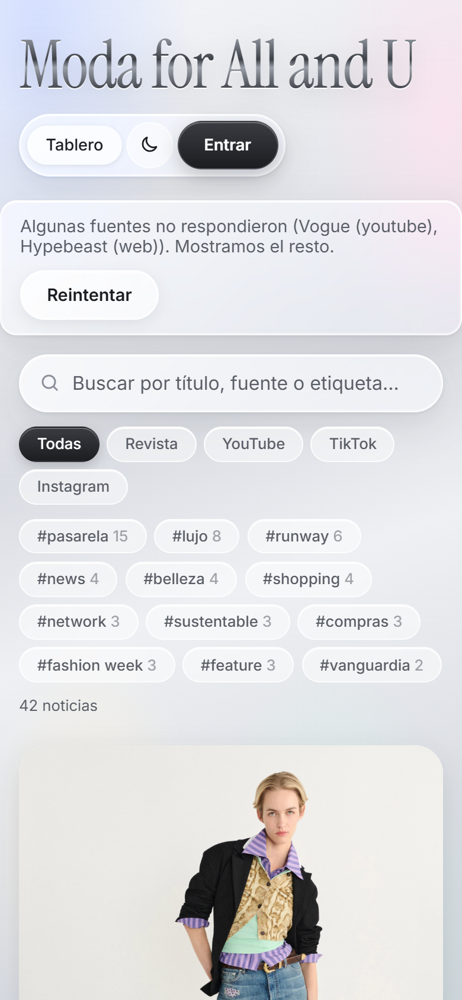 | 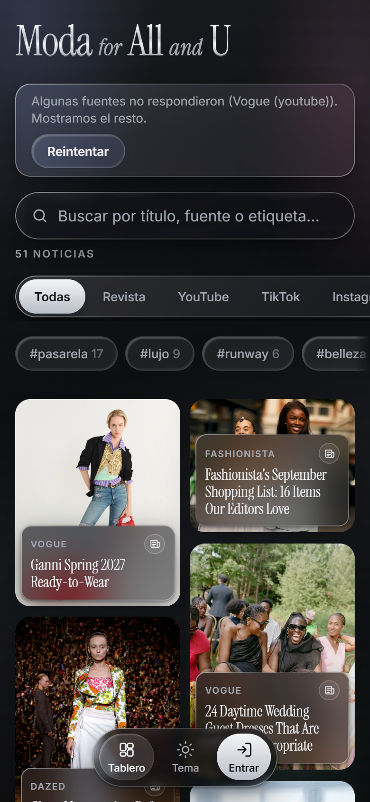 |

- **Filtros:** el buscador es una píldora de vidrio líquido de 48 px con el conteo al lado; la plataforma es un **control segmentado**; las etiquetas se deslizan de lado en el celular.
- **Tablero disperso** (pendiente desde el Sprint 3): desde 1,024 px las tarjetas giran entre −0.7° y 0.8°, como recortes pegados a mano. Con el pop se enderezan.
- **Aviso de fuentes caídas:** alineado con el contenido y con un botón pequeño.
- **Pie de página** editorial con la marca, las fuentes y el aviso de que las imágenes son de cada medio.

### Página de la noticia (estilo Wired)

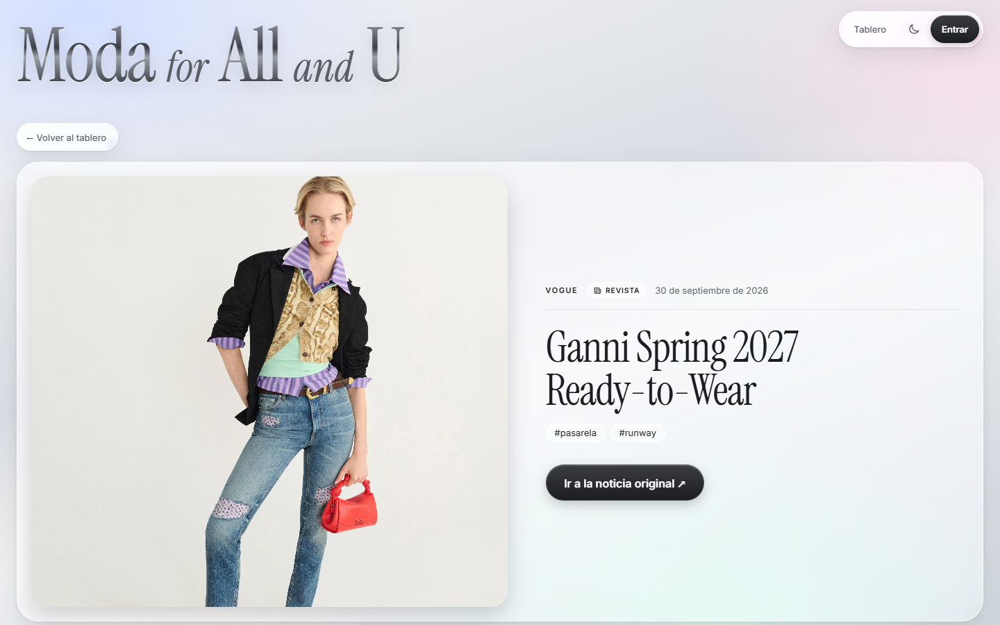

- Fuente como *eyebrow*, fecha y una línea fina antes del título.
- Título con `text-wrap: balance` y resumen a 17 px / 1.47.
- La foto se recorta desde abajo (`object-position: center 20%`), porque antes cortaba la cabeza de la modelo.
- "Volver al tablero" es una cápsula de vidrio líquido.

### Tarjetas de video (YouTube)

La miniatura de YouTube es 16:9, más baja que una foto de revista, y el panel de vidrio encima la tapaba casi completa: se veían más las letras que la imagen. Ahora, como en YouTube, **la miniatura se ve entera** con un botón de reproducir de vidrio al centro, y la fuente y el título van **debajo**, en la misma tarjeta. El zoom del pop se queda dentro de la miniatura.

### Imágenes

- Las **6 primeras** tarjetas piden su imagen de inmediato y con prioridad alta (`loading="eager"`, `fetchPriority="high"`); las demás esperan a acercarse (`lazy`).
- Cada imagen aparece con un **fundido** al cargar. Si no carga, la tarjeta muestra el nombre de la fuente en plata en lugar de un hueco.
- La foto de la noticia se pide con prioridad alta.

---

## 7. Pruebas

| Prueba | Resultado |
|---|---|
| Pop: se deforma durante la animación | ✅ hasta 13 % |
| Pop: termina más grande y sin deformar | ✅ 1.045 × 1.045 |
| Doble clic abre la fuente original y no cambia de página | ✅ |
| Un clic abre la página de la noticia correcta | ✅ |
| El botón abre la fuente en una pestaña nueva | ✅ |
| Aparecen noticias relacionadas | ✅ 12 |
| El enlace directo a una noticia funciona | ✅ |
| Enter con el teclado abre la noticia | ✅ |
| Algoritmo de relacionadas (Vitest) | ✅ 4 pruebas |
| Suite completa de Vitest (Sprint 9) | ✅ 41 de 41 |
| `npm run api:check` con las 10 fuentes (Sprint 9) | ✅ 10/10 |
| Pruebas de sprints anteriores (rutas, validaciones, filtros) | ✅ 12 + 19 + 10 |
| Build de producción con la política de seguridad | ✅ sin violaciones |
| **Sprint 10:** celular de 390 px sin scroll horizontal | ✅ 0 px |
| Refracción visible (píxeles que cambian con y sin `liquid-refraction`) | ✅ 9.2 % (antes del ajuste, 0.1 %) |
| Producción con la CSP de `vercel.json`: filtro activo y sin violaciones | ✅ |
| Barra de pestañas con sesión de admin (5 pestañas) en 390 px | ✅ |
| Final del scroll: 91 tarjetas y 0 imágenes con error | ✅ |
| Linter, 41 pruebas de Vitest y build | ✅ |

### Bug encontrado al probar

La página de la noticia usaba `useEffect(() => window.scrollTo({ behavior: 'smooth' }))`. En Chrome reciente, el scroll suave **regresa una Promise**, y React la tomaba como función de limpieza y fallaba. El `ErrorBoundary` lo contuvo, pero la página no se veía. Se corrigió escribiendo el efecto con llaves para que no regrese nada.

### Bugs encontrados en el Sprint 10

| Bug | Corrección |
|---|---|
| El logo nuevo del Sprint 9 usaba las clases `logo__initial` y `logo__joiner`, pero no tenían estilos; la leyenda se veía toda igual | Estilos para los conectores; se borró `.header__tagline`, que ya no se usaba |
| En modo oscuro el anillo de foco era grafito sobre fondo grafito (invisible al navegar con teclado) | El foco usa `--color-text`, que cambia con el tema |
| La refracción no se veía (0.1 % de píxeles) | Desenfoque de 4 px y tinte propio en el vidrio líquido |
| La foto de la noticia cortaba la cara | `object-position: center 20%` |
