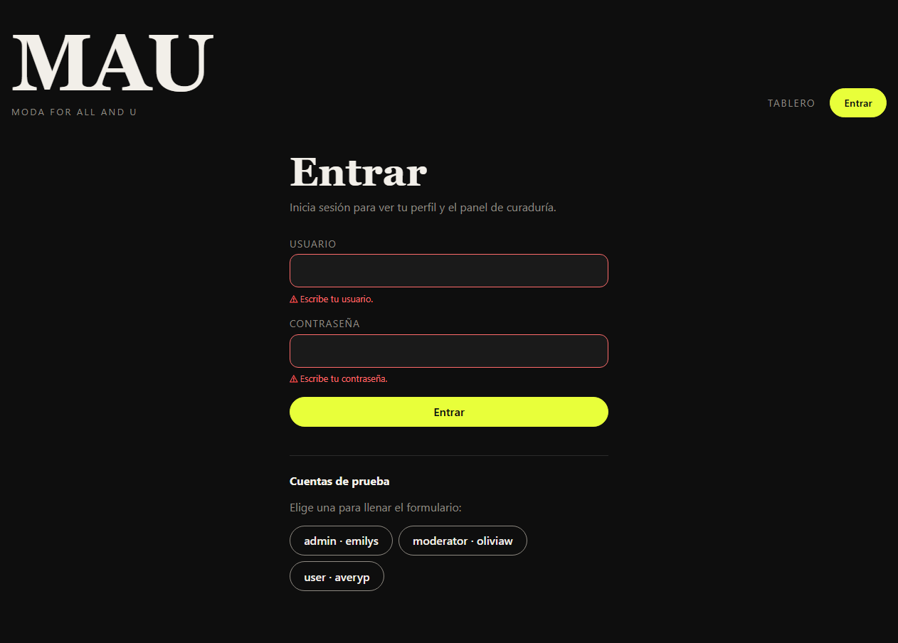
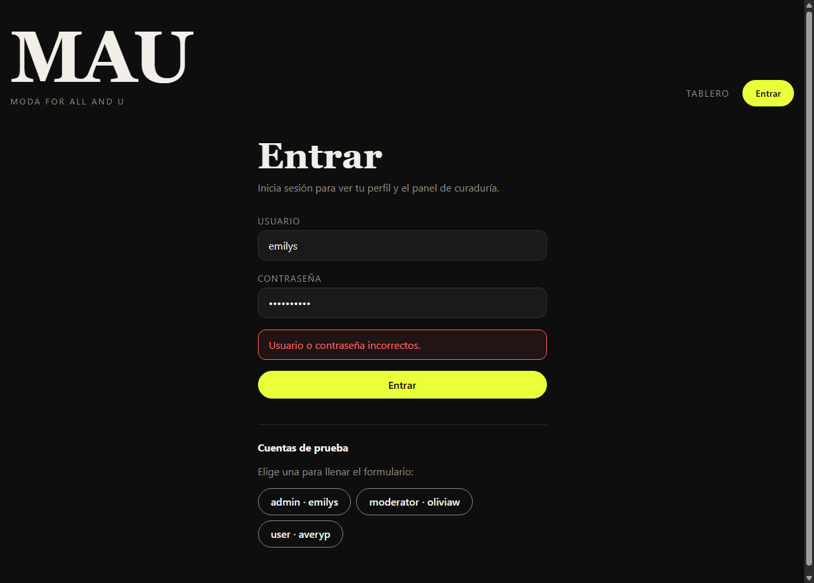
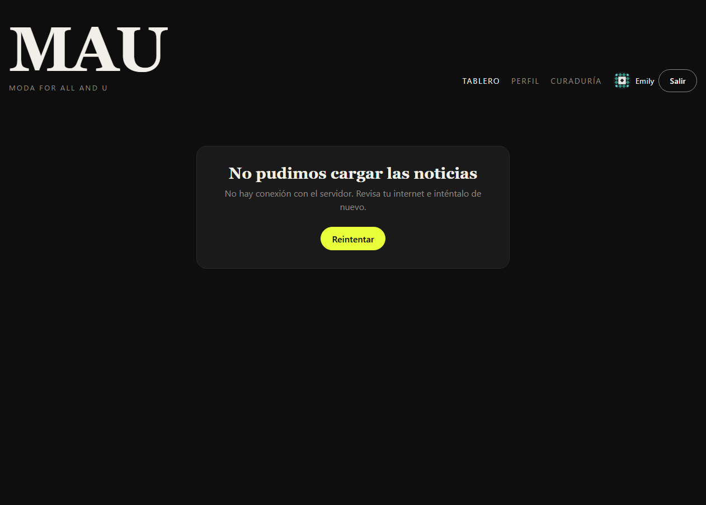

# 🧯 Validaciones y manejo de errores

Cómo MAU valida los datos con **Zod** y cómo informa al usuario cuando algo sale mal.

---

## 1. Resumen

| Qué | Cómo |
|---|---|
| Validar formularios | Esquemas de Zod + hook `useZodForm` + componente `FormField` |
| Validar respuestas de las APIs | Cada respuesta pasa por un esquema de Zod antes de usarse |
| Validar datos guardados en el navegador | La sesión y los posts de `localStorage` se validan al leerlos |
| Clasificar errores de red y del backend | Cliente HTTP central (`httpClient.js`) que lanza `AppError` |
| Mensajes para el usuario | `getErrorMessage()` traduce cada error a un texto claro |
| Mostrar errores | Mensajes bajo cada campo, alertas de formulario, avisos emergentes (*toasts*), estados de error con **Reintentar** y un `ErrorBoundary` |

---

## 2. Esquemas de Zod

Viven en [`src/schemas/`](../src/schemas/):

| Archivo | Esquema | Qué valida |
|---|---|---|
| `auth.js` | `LoginFormSchema` | Formulario de login |
| `auth.js` | `TokensSchema`, `UserSchema`, `MembersResponseSchema` | Respuestas de DummyJSON |
| `auth.js` | `SessionSchema` | Sesión guardada en `localStorage` |
| `news.js` | `NewsSchema` | Modelo de noticia que usa toda la app |
| `news.js` | `CuratedPostFormSchema` | Formulario para agregar un post en Curaduría |
| `rss.js` | `RssResponseSchema`, `RssItemSchema` | Respuestas de rss2json |

### Formulario de login

| Campo | Reglas | Mensaje |
|---|---|---|
| Usuario | Obligatorio | "Escribe tu usuario." |
| | Mínimo 3 caracteres | "El usuario debe tener al menos 3 caracteres." |
| | Máximo 30 caracteres | "El usuario no puede pasar de 30 caracteres." |
| | Solo letras, números, `.` o `_` | "El usuario solo lleva letras, números, punto o guion bajo." |
| Contraseña | Obligatoria | "Escribe tu contraseña." |
| | Mínimo 6 caracteres | "La contraseña debe tener al menos 6 caracteres." |

### Formulario "Agregar un post" (Curaduría)

| Campo | Reglas |
|---|---|
| Título | 5 a 120 caracteres |
| Plataforma | Una de: TikTok, Instagram, YouTube, Revista/web |
| Enlace del post | URL válida que empiece con `http(s)://` y **corresponda a la plataforma** (un enlace de Instagram no se acepta como TikTok) |
| Imagen de portada | URL válida `http(s)://`. Se bloquean enlaces peligrosos como `javascript:` |
| Etiquetas | Separadas por comas, de 1 a 5, sin espacios. Se convierten a minúsculas y se quita el `#` |

Ejemplo del esquema, con una **transformación** (texto → lista) y una **regla entre campos** (`refine`):

```js
tags: z.string().trim()
  .min(1, 'Agrega al menos una etiqueta.')
  .transform(splitTags)            // "#Streetwear, japón" → ["streetwear", "japón"]
  .pipe(z.array(z.string().regex(/^[a-z0-9áéíóúñü-]+$/, '…')).max(5, 'Máximo 5 etiquetas.')),
// …
}).refine((post) => matchesPlatform(post.url, post.platform), {
  path: ['url'],
  message: 'El enlace no corresponde a la plataforma elegida.',
})
```

---

## 3. Formularios: `useZodForm` + `FormField`

[`useZodForm`](../src/hooks/useZodForm.js) recibe un esquema y maneja todo el formulario:

```jsx
const form = useZodForm(LoginFormSchema, { username: '', password: '' })

<form onSubmit={form.handleSubmit(onSubmit)} noValidate>
  <FormField label="Usuario" {...form.field('username')} />
  <FormField label="Contraseña" type="password" {...form.field('password')} />
  {form.formError && <p className="form-alert" role="alert">{form.formError}</p>}
  <button disabled={form.submitting}>Entrar</button>
</form>
```

- **Cuándo aparecen los errores:** al salir de un campo o al enviar el formulario, no mientras el usuario todavía escribe por primera vez. Una vez que el campo muestra un error, se revalida en cada tecla para que el mensaje desaparezca en cuanto se corrige.
- **`onSubmit` solo se ejecuta con datos válidos**, ya transformados por Zod (sin espacios de más, etiquetas como lista…).
- **Errores del backend:** si `onSubmit` lanza un error, se muestra en `form.formError` con un mensaje claro.
- **Accesibilidad:** [`FormField`](../src/components/FormField.jsx) marca el campo con `aria-invalid` y lo liga a su mensaje con `aria-describedby`, para que los lectores de pantalla lo anuncien.

---

## 4. Errores de las peticiones al backend

### Cliente HTTP central

Todas las peticiones pasan por [`requestJson()`](../src/services/httpClient.js), que:

1. Cancela la petición si tarda más de **10 segundos**.
2. Convierte cualquier falla en un **`AppError`** con un tipo (`kind`).
3. Valida la respuesta con el esquema de Zod que se le pase.

| `kind` | Cuándo ocurre | Mensaje para el usuario |
|---|---|---|
| `network` | Sin internet, servidor caído o petición bloqueada | "No hay conexión con el servidor. Revisa tu internet e inténtalo de nuevo." |
| `timeout` | El servidor tardó más de 10 s | "El servidor tardó demasiado en responder. Inténtalo de nuevo." |
| `http` 401 | Token vencido o inválido | "Tu sesión expiró. Vuelve a iniciar sesión." |
| `http` 403 | Sin permiso | "No tienes permiso para realizar esta acción." |
| `http` 404 | No existe el recurso | "No encontramos lo que buscabas." |
| `http` 429 | Demasiadas peticiones | "Hiciste demasiadas solicitudes. Espera un momento…" |
| `http` 5xx | Error del servidor | "El servidor tuvo un problema. Inténtalo más tarde." |
| `validation` | La respuesta no cumple el esquema de Zod | "El servidor respondió con datos inesperados. Inténtalo más tarde." |
| `auth` | Login con credenciales incorrectas | "Usuario o contraseña incorrectos." |
| `storage` | No se pudo guardar en el navegador | "No se pudo guardar el post en este navegador." |

La traducción de error a mensaje está en un solo lugar: [`getErrorMessage()`](../src/utils/errors.js).

### Cómo se informa en cada parte de la app

| Dónde | Error | Cómo se informa |
|---|---|---|
| Tablero | Fallan **todas** las fuentes | Bloque "No pudimos cargar las noticias" con el motivo y botón **Reintentar** |
| Tablero | Fallan **algunas** fuentes | Aviso con los nombres de las fuentes caídas; el resto sí se muestra |
| Tablero | Una noticia viene mal formada | Se descarta sin afectar a las demás |
| Login | Datos inválidos | Mensaje bajo cada campo |
| Login | Credenciales incorrectas, sin internet… | Alerta roja arriba del botón |
| Login | Éxito | Aviso emergente "Hola, Emily. Iniciaste sesión." |
| Curaduría | No carga la comunidad | Bloque de error con **Reintentar** |
| Curaduría | El backend rechaza el token (401) | Aviso "Tu sesión expiró" y regreso al login |
| Curaduría | Post agregado | Aviso emergente de éxito |
| Al abrir la app | La sesión guardada ya no es válida | Aviso "Tu sesión expiró. Vuelve a iniciar sesión." |
| Al abrir la app | No hay internet para verificar la sesión | Aviso; los tokens se conservan para intentarlo después |
| Cualquier página | Error inesperado al dibujar un componente | `ErrorBoundary`: "Algo salió mal", con **Reintentar** y **Volver al tablero** |

### Avisos emergentes (*toasts*)

`NotificationProvider` permite mostrar un aviso desde cualquier componente:

```js
const notify = useNotify()
notify({ tone: 'success', message: 'Se agregó al tablero.' })   // tone: success | error | info
```

Los avisos desaparecen solos a los 5 segundos o se cierran con **×**. Usan `aria-live` para que los lectores de pantalla los anuncien.

### Error Boundary

[`ErrorBoundary`](../src/components/ErrorBoundary.jsx) envuelve el contenido de cada página. Si un componente falla al renderizar, se muestra un mensaje en vez de dejar la pantalla en blanco, y el header sigue funcionando. Al cambiar de página se reinicia solo.

---

## 5. Datos del navegador

`localStorage` puede ser modificado por el usuario, así que **nunca se confía en él**:

| Dato | Validación | Si no es válido |
|---|---|---|
| `mau.session` (tokens) | `SessionSchema` | Se borra y el usuario queda sin sesión |
| `mau.curated` (posts agregados) | `NewsSchema` por cada post | Se descartan solo los posts inválidos |

---

## 6. Pruebas realizadas

Se probaron en Chrome, en modo desarrollo. Para simular fallas se usaron las herramientas del navegador: modo sin conexión y bloqueo de URLs.

| # | Caso | Resultado | ✔ |
|---|---|---|---|
| 1 | Enviar el login vacío | "Escribe tu usuario." y "Escribe tu contraseña." | ✅ |
| 2 | Usuario de 2 letras y contraseña de 3 | Mensajes de longitud mínima | ✅ |
| 3 | Usuario con espacios y `!` | Mensaje de caracteres permitidos y `aria-invalid` | ✅ |
| 4 | Contraseña incorrecta | "Usuario o contraseña incorrectos." | ✅ |
| 5 | Iniciar sesión sin internet | "No hay conexión con el servidor…" | ✅ |
| 6 | Login correcto | Aviso "Hola, Emily. Iniciaste sesión." | ✅ |
| 7 | Enviar el formulario de post vacío | 5 mensajes, uno por campo | ✅ |
| 8 | URL `hola`, imagen `javascript:alert(1)` y etiqueta con espacio | 3 mensajes específicos | ✅ |
| 9 | Plataforma TikTok con enlace de Instagram | "El enlace no corresponde a la plataforma elegida." | ✅ |
| 10 | Post válido | Aparece en la tabla, se limpia el formulario y sale un aviso | ✅ |
| 11 | Abrir el tablero después | El post nuevo aparece en el tablero | ✅ |
| 12 | Bloquear una fuente (Dazed) | Aviso "Algunas fuentes no respondieron (Dazed)"; el resto se muestra | ✅ |
| 13 | Bloquear todas las fuentes | "No pudimos cargar las noticias" + Reintentar | ✅ |
| 14 | Desbloquear y pulsar Reintentar | El tablero carga | ✅ |
| 15 | Post alterado a mano en `localStorage` | Se descarta; no aparece en el tablero | ✅ |
| 16 | Sesión con forma inválida en `localStorage` | Se borra y se redirige al login | ✅ |
| 17 | Token falso en `localStorage` | El backend lo rechaza; aviso "Tu sesión expiró" | ✅ |

> El `ErrorBoundary` no se probó de forma automática porque ningún flujo normal de la app provoca un error de renderizado.

### Capturas

| Validación de Zod | Error del backend | Sin conexión |
|---|---|---|
|  |  |  |

---

## 7. Cómo probarlo tú

1. `npm run dev`
2. **Validaciones:** en `/login`, da clic en **Entrar** con los campos vacíos. Luego prueba un usuario de 2 letras.
3. **Error del backend:** entra con `emilys` y una contraseña incorrecta.
4. **Sin conexión:** abre DevTools → pestaña **Network** → cambia *No throttling* por **Offline** y recarga el tablero. Vuelve a *No throttling* y pulsa **Reintentar**.
5. **Formulario de posts:** entra como `emilys`, ve a **Curaduría** y prueba enlaces que no correspondan a la plataforma.
