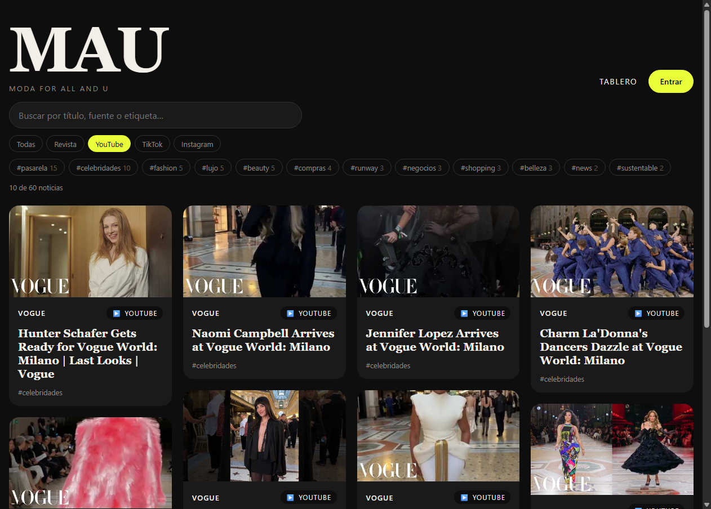

# ⚡ Optimización del rendimiento

Qué partes de MAU se analizaron, qué mecanismos de React se aplicaron y cuánto mejoró, con mediciones reales.

---

## 1. Análisis: ¿qué se podía optimizar?

| Parte de la app | Problema encontrado | ¿Vale la pena optimizar? |
|---|---|---|
| **Tablero con filtros** (nuevo en este sprint) | Cada tecla en el buscador recalculaba las etiquetas, recorría todas las noticias y volvía a dibujar **todas** las tarjetas | ✅ Sí: es la interacción más frecuente y la más costosa |
| **Carga de noticias** | Cada vez que se volvía al tablero se repetían todas las peticiones a rss2json | ✅ Sí: gasta red y hace esperar al usuario |
| **Páginas de login, perfil y curaduría** | Se descargaban aunque el visitante solo viera el tablero | ⚠️ Poco: son pequeñas, pero crecerán |
| `AuthProvider` y `NotificationProvider` | Ya usaban `useMemo` y `useCallback` desde sprints anteriores | Ya estaban optimizados |
| Header, perfil, 403, 404 | Componentes pequeños que se dibujan pocas veces | ❌ No: optimizarlos solo agrega complejidad |

> **Criterio:** `useMemo`, `useCallback` y `memo` tienen un costo (memoria y código más difícil de leer). Se aplican solo donde **se midió** un problema, no en todos los componentes.

---

## 2. Funcionalidad nueva: filtros del tablero

Para este sprint se agregó la historia **HU-06: filtrar el tablero**, que el backlog tenía pendiente:

- **Buscador** por título, fuente o etiqueta
- **Filtro por plataforma:** Todas, Revista, YouTube, TikTok, Instagram
- **Filtro por etiqueta:** las 12 más usadas, con su conteo
- Resumen "*X de Y noticias*" y un mensaje cuando no hay resultados



Primero se implementó **sin optimizar**, se midió, y después se aplicaron las optimizaciones.

---

## 3. Mecanismos aplicados

### `useMemo`: no repetir cálculos costosos

En [`useNewsFilters.js`](../src/hooks/useNewsFilters.js):

| Qué se memoriza | Se recalcula solo cuando cambia… | Beneficio |
|---|---|---|
| `searchIndex`: el texto de búsqueda de cada noticia en minúsculas | La lista de noticias | No se arma el texto de 60 noticias en cada tecla |
| `tags`: las 12 etiquetas más usadas con su conteo | La lista de noticias | No se recuenta todo al escribir o filtrar |
| `filtered`: la lista filtrada | Noticias, texto, plataforma o etiqueta | Mientras los filtros no cambien, la lista es **el mismo arreglo**, así `memo` puede saltarse renders |
| `visibleIds`: el `Set` de noticias visibles | La lista filtrada | Revisar si una tarjeta es visible es instantáneo |

```js
const filtered = useMemo(() => {
  const text = deferredQuery.trim().toLowerCase()
  return news.filter((item, i) =>
    (platform === 'todas' || item.platform === platform) &&
    (!activeTag || item.tags.includes(activeTag)) &&
    (!text || searchIndex[i].includes(text)))
}, [news, searchIndex, platform, activeTag, deferredQuery])
```

### `React.memo`: no volver a dibujar lo que no cambió

| Componente | Efecto |
|---|---|
| [`NewsCard`](../src/components/NewsCard.jsx) | Una tarjeta solo se vuelve a dibujar si cambia **su** noticia |
| [`Board`](../src/components/Board.jsx) | Si la lista y los visibles son los mismos, se salta el tablero completo |
| [`NewsFilters`](../src/components/NewsFilters.jsx) | Solo se redibuja si cambian sus props |

**Idea clave:** el tablero conserva **todas** las tarjetas montadas y oculta las que no coinciden (`hidden`), en lugar de quitarlas y volver a crearlas. Como `NewsCard` usa `memo`, al cambiar un filtro solo cambia la visibilidad; ninguna tarjeta se vuelve a dibujar.

### `useCallback`: funciones estables

`memo` compara las props. Si una función se crea de nuevo en cada render, `memo` cree que cambió y no sirve. Con `useCallback` la función conserva la misma referencia:

```js
const toggleTag = useCallback(
  (tag) => setActiveTag((current) => (current === tag ? null : tag)),
  [],
)
```

(`setQuery` y `setPlatform` ya son estables porque vienen de `useState`.)

### `useDeferredValue`: escribir sin trabarse

```js
const deferredQuery = useDeferredValue(query)
```

El campo de búsqueda se actualiza al instante con cada tecla, y el filtrado del tablero se hace con **prioridad baja**. Si el usuario escribe rápido, React descarta los filtrados intermedios. Mientras el tablero va un paso atrás, se muestra un poco transparente (`board--stale`).

### `React.lazy` + `Suspense`: descargar páginas solo al visitarlas

En [`App.jsx`](../src/App.jsx), `Login`, `Profile`, `Curation` y `NotFound` se cargan con `lazy()`. El `Suspense` vive dentro de [`Layout`](../src/components/Layout.jsx), así el header sigue visible mientras se descarga una página.

### Caché de noticias (fuera de React, en el servicio)

En [`newsService.js`](../src/services/newsService.js):

- Las noticias se guardan **5 minutos en memoria**. Volver al tablero no repite las peticiones.
- Si dos componentes piden noticias al mismo tiempo, **comparten la misma petición**.
- Un error **no se guarda** en caché.
- El botón **Reintentar** fuerza una carga nueva (`force: true`).
- Los posts curados se leen siempre frescos, para que un post recién agregado aparezca de inmediato.

---

## 4. Resultados medidos

### Cómo se midió

- Chrome controlado por un script, en modo desarrollo.
- **CPU 4 veces más lenta**, para simular un celular de gama media.
- Tiempo de render con la API [`<Profiler>`](https://react.dev/reference/react/Profiler) de React, que envuelve al tablero en [`Home.jsx`](../src/pages/Home.jsx) y guarda los datos con [`logRender`](../src/utils/profiler.js).
- Renders de tarjetas con un contador temporal, quitado después de medir.
- Cada escenario se corrió **3 veces**; se reporta la **mediana**.
- En desarrollo, `StrictMode` dibuja cada componente dos veces, así que las cifras de renders van duplicadas en **ambas** columnas. La comparación sigue siendo justa.

### Tablero con 60 noticias

| Escenario | Métrica | Antes | Después | Mejora |
|---|---|---|---|---|
| Escribir "vogue" (5 teclas) | Renders de tarjetas | 228 | **0** | −100 % |
| | Tiempo de render del tablero | 1,110 ms | **155 ms** | **~7× más rápido** |
| Activar y quitar una etiqueta | Renders de tarjetas | 150 | **0** | −100 % |
| | Tiempo de render del tablero | 1,097 ms | **185 ms** | **~6× más rápido** |
| Ir al login y volver al tablero | Peticiones a rss2json | 12 | **0** | −100 % |
| | Tiempo hasta ver las noticias | 495 ms | **161 ms** | ~3× más rápido |
| Primera carga (desarrollo) | Peticiones a rss2json | 12 | **6** | −50 %* |

\* En desarrollo, `StrictMode` monta el tablero dos veces. Antes eso duplicaba las 6 peticiones; ahora la caché las comparte. En producción siempre son 6.

**Versión intermedia:** con solo `useMemo` + `memo` (sin ocultar tarjetas), quitar una etiqueta todavía volvía a crear entre 90 y 114 tarjetas (783 ms). Conservarlas montadas y ocultarlas bajó eso a 0.

### Tamaño del JavaScript inicial (producción)

| | Antes | Después |
|---|---|---|
| JS que descarga el tablero | 368.1 kB (114.4 kB gzip) | 364.6 kB (115.3 kB gzip) |
| Páginas diferidas (se descargan al visitarlas) | — | ~9 kB en 5 archivos |

**Conclusión honesta:** con el tamaño actual de las páginas, `React.lazy` casi no reduce la descarga inicial. Sin comprimir baja 3.5 kB, pero con gzip sube ~1 kB por la sobrecarga de dividir en archivos y por el código nuevo de los filtros. La mayor parte del peso es React y Zod, que el tablero necesita desde el inicio. Se mantiene porque el beneficio crecerá conforme el perfil y la curaduría sumen funciones.

---

## 5. Pruebas de funcionamiento

| # | Caso | ✔ |
|---|---|---|
| 1 | El tablero muestra las 60 noticias y el resumen "60 noticias" | ✅ |
| 2 | Al abrir el tablero no se descargan Login, Perfil ni Curaduría | ✅ |
| 3 | Buscar "vogue" deja solo noticias de Vogue (20 de 60) | ✅ |
| 4 | Una búsqueda sin resultados muestra "No hay noticias que coincidan…" | ✅ |
| 5 | Filtro YouTube deja solo videos (10 de 60) | ✅ |
| 6 | Filtro `#pasarela` deja solo noticias con esa etiqueta (15 de 60) | ✅ |
| 7 | Quitar la etiqueta regresa las 60 | ✅ |
| 8 | El código del Login se descarga al entrar a `/login` | ✅ |
| 9 | Volver al tablero usa la caché (0 peticiones) | ✅ |
| 10 | **Reintentar** ignora la caché y recupera una fuente caída | ✅ |

Además se volvieron a correr las pruebas de los sprints anteriores: rutas protegidas 12 de 12 y validaciones 19 de 19.

### Mejora encontrada al probar

Si había una sesión guardada, la página de login mostraba el formulario mientras la verificaba con el backend. Si la sesión era válida, redirigía al perfil de golpe, aunque el usuario ya estuviera escribiendo. Ahora el login muestra **"Verificando sesión…"** hasta saber si hay sesión.

---

## 6. Cómo verlo tú

1. `npm run dev` y abre el tablero.
2. **React DevTools → Profiler:** graba mientras escribes en el buscador. Verás que las `NewsCard` no se vuelven a dibujar (aparecen en gris, "Did not render").
3. **Consola:** después de filtrar, escribe `window.__MAU_RENDERS__` para ver el tiempo de cada render del tablero.
4. **DevTools → Network:** filtra por `rss2json`, ve a Entrar y vuelve al tablero. No aparecen peticiones nuevas.
