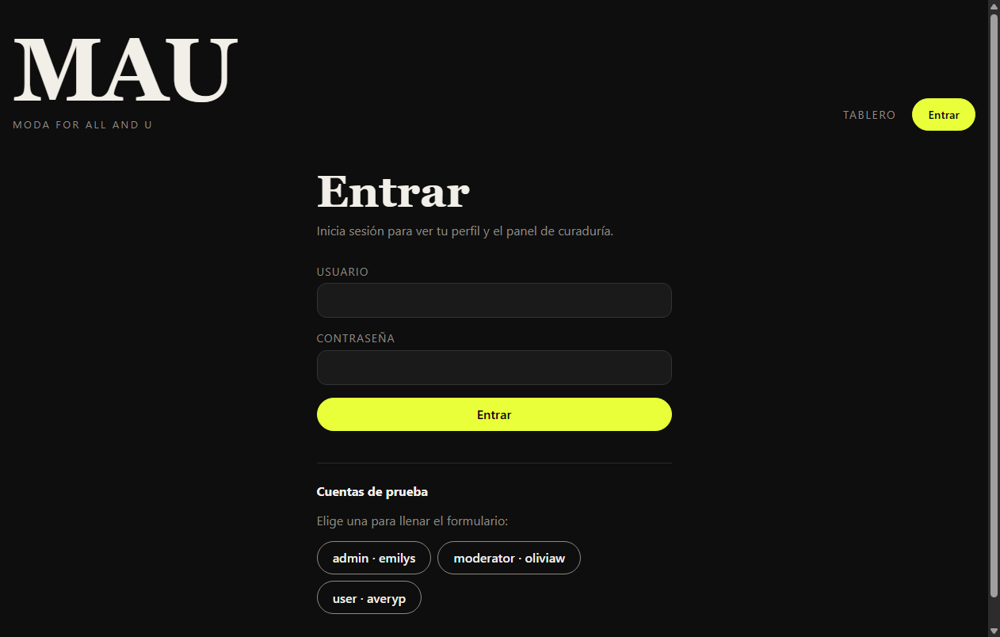
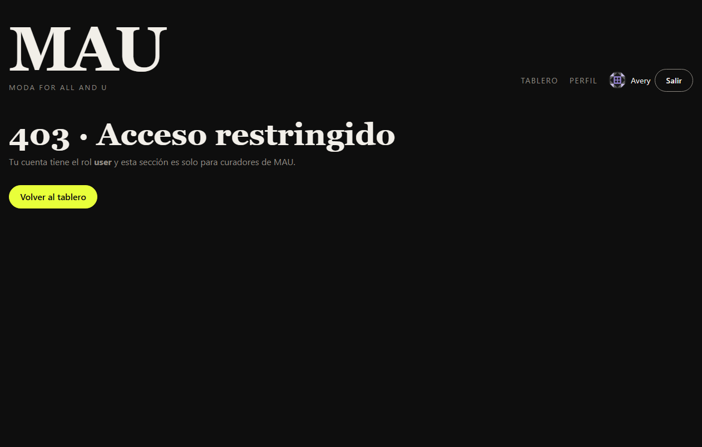
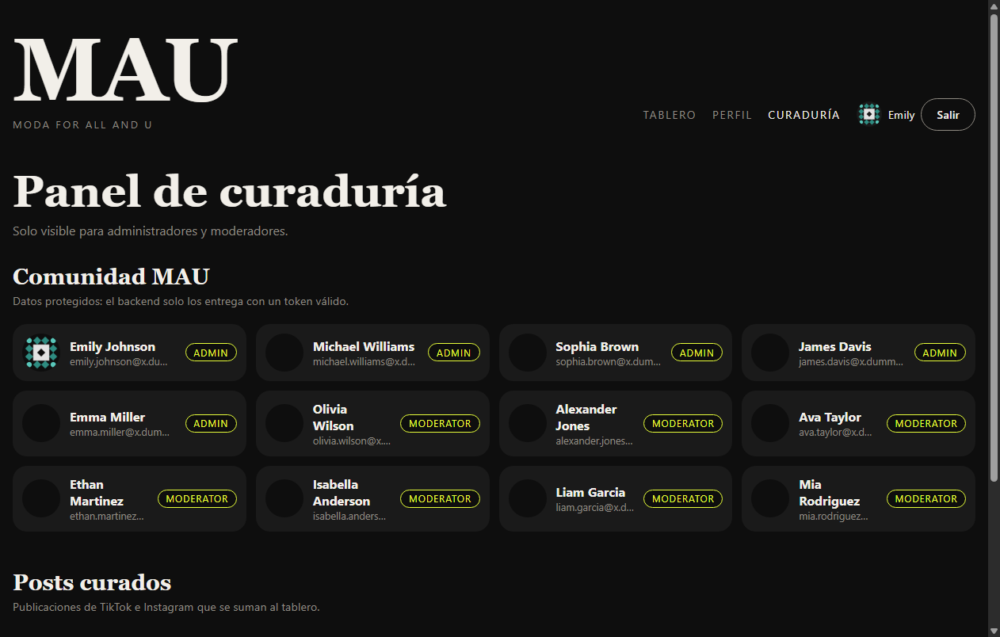

# 🔐 Rutas y protección de acceso

Cómo MAU decide quién puede ver cada página, y cómo el backend respalda esa decisión.

---

## 1. Mapa de rutas

| Ruta | Página | Acceso | Por qué |
|---|---|---|---|
| `/` | Tablero de noticias | 🌍 Pública | Es la experiencia principal; cualquiera puede explorar |
| `/login` | Iniciar sesión | 🌍 Pública | Si ya hay sesión, redirige automáticamente |
| `/perfil` | Perfil del usuario | 🔒 Con sesión | Muestra datos personales (correo, rol, favoritos) |
| `/curaduria` | Panel de curaduría | 🛡️ Con sesión y rol `admin` o `moderator` | Muestra datos de la comunidad y la gestión de posts curados |
| `*` | 404 | 🌍 Pública | Cualquier ruta que no existe |

### Roles

El rol viene del **backend**, no del navegador, así que el usuario no puede cambiarlo.

| Rol | Tablero | Perfil | Curaduría |
|---|---|---|---|
| Sin sesión | ✅ | ↪️ Redirige a `/login` | ↪️ Redirige a `/login` |
| `user` | ✅ | ✅ | ⛔ 403 |
| `moderator` | ✅ | ✅ | ✅ |
| `admin` | ✅ | ✅ | ✅ |

### Cuentas de prueba

La pantalla de login tiene botones que llenan estas cuentas automáticamente.

| Rol | Usuario | Contraseña |
|---|---|---|
| admin | `emilys` | `emilyspass` |
| moderator | `oliviaw` | `oliviawpass` |
| user | `averyp` | `averyppass` |

---

## 2. Protección en el frontend (React)

### Componentes involucrados

| Archivo | Responsabilidad |
|---|---|
| [`App.jsx`](../src/App.jsx) | Define las rutas con React Router y agrupa las protegidas |
| [`routes/ProtectedRoute.jsx`](../src/routes/ProtectedRoute.jsx) | Decide si deja pasar, redirige al login o muestra 403 |
| [`context/AuthProvider.jsx`](../src/context/AuthProvider.jsx) | Guarda quién está conectado y expone `login` y `logout` |
| [`hooks/useAuth.js`](../src/hooks/useAuth.js) | Da acceso a la sesión desde cualquier componente |
| [`services/authService.js`](../src/services/authService.js) | Habla con el backend de autenticación |
| [`utils/session.js`](../src/utils/session.js) | Guarda y lee los tokens en el navegador |

### Cómo se declaran las rutas protegidas

```jsx
<Route element={<Layout />}>
  <Route index element={<Home />} />
  <Route path="login" element={<Login />} />

  {/* Requieren sesión */}
  <Route element={<ProtectedRoute />}>
    <Route path="perfil" element={<Profile />} />
  </Route>

  {/* Requieren sesión y rol de curador */}
  <Route element={<ProtectedRoute roles={CURATOR_ROLES} />}>
    <Route path="curaduria" element={<Curation />} />
  </Route>
</Route>
```

`ProtectedRoute` es una **ruta contenedora**: envuelve a sus rutas hijas y usa `<Outlet />` para mostrarlas solo si se cumplen las condiciones. Agregar una ruta protegida nueva es solo meterla dentro del grupo que corresponda.

### Lógica de `ProtectedRoute`

```
¿Se está verificando una sesión guardada?  → "Verificando sesión…"
¿No hay usuario?                           → redirige a /login (recordando la ruta original)
¿La ruta pide roles y el usuario no tiene?  → página 403
En otro caso                                → muestra la página
```

Al entrar desde `/login`, el usuario vuelve a la página que intentaba abrir. Por ejemplo: `/curaduria` → `/login` → `/curaduria`.

---

## 3. Seguridad del lado del backend

> ⚠️ **La protección del frontend es solo experiencia de usuario.** Cualquiera puede modificar el JavaScript en su navegador. La seguridad real está en que **el backend no entregue datos privados sin un token válido**.

### Backend elegido: DummyJSON Auth

[DummyJSON](https://dummyjson.com/docs/auth) es una API gratuita que emite y valida **tokens JWT reales**. No requiere clave ni registro.

| Endpoint | Método | Uso en MAU |
|---|---|---|
| `/auth/login` | POST | Recibe usuario y contraseña; devuelve `accessToken` y `refreshToken` |
| `/auth/me` | GET 🔒 | Valida el token y devuelve el usuario con su **rol** |
| `/auth/refresh` | POST | Cambia un `refreshToken` por un token nuevo cuando el anterior expiró |
| `/auth/users` | GET 🔒 | Datos de la comunidad que se muestran en el panel de curaduría |

🔒 = sin el encabezado `Authorization: Bearer <token>` válido, el backend responde **401**:

```http
GET https://dummyjson.com/auth/me
→ 401 { "message": "Access Token is required" }

GET https://dummyjson.com/auth/me
Authorization: Bearer token-falso
→ 401 { "message": "Invalid/Expired Token!" }
```

### Flujo de inicio de sesión

```
Login.jsx ──usuario/contraseña──► POST /auth/login ──► accessToken + refreshToken
                                        │
                                        ▼
                        GET /auth/me (Bearer accessToken) ──► usuario con rol
                                        │
                                        ▼
            AuthProvider guarda la sesión ──► ProtectedRoute deja pasar
```

### Flujo al abrir o recargar la app

```
¿Hay tokens guardados?
   no ─► visitante sin sesión
   sí ─► GET /auth/me
           200 ─► sesión válida
           401 ─► POST /auth/refresh
                    200 ─► token renovado, sesión válida
                    error ─► se borran los tokens, visitante sin sesión
```

**El frontend nunca confía en los datos guardados en el navegador.** Siempre le pregunta al backend quién es el usuario y cuál es su rol.

### Si el token deja de ser válido a mitad de la sesión

El panel de curaduría pide `/auth/users` con el token. Si el backend responde **401**, se llama a `logout()`, y `ProtectedRoute` manda al usuario a `/login` automáticamente.

---

## 4. Pruebas realizadas

Se probaron en un navegador real, en modo desarrollo:

| # | Caso | Resultado esperado | ✔ |
|---|---|---|---|
| 1 | Abrir `/perfil` sin sesión | Redirige a `/login` | ✅ |
| 2 | Contraseña incorrecta | "Usuario o contraseña incorrectos." | ✅ |
| 3 | Login como `user` | Regresa a `/perfil` con sus datos | ✅ |
| 4 | `user` abre `/curaduria` | Página 403 | ✅ |
| 5 | Recargar la página con sesión | La sesión se mantiene | ✅ |
| 6 | Token alterado en `localStorage` | El backend lo rechaza, se borra la sesión y redirige a `/login` | ✅ |
| 7 | Abrir `/curaduria` sin sesión y entrar como `admin` | Regresa a `/curaduria` con los datos de la comunidad | ✅ |
| 8 | Abrir `/login` con sesión activa | Redirige a `/perfil` | ✅ |
| 9 | Salir y abrir `/curaduria` | Redirige a `/login` | ✅ |
| 10 | Ruta inexistente | Página 404 | ✅ |
| 11 | Tablero sin sesión | Carga las noticias | ✅ |

### Capturas

| Login | 403 para rol `user` | Curaduría como `admin` |
|---|---|---|
|  |  |  |

---

## 5. Despliegue en Vercel

Como las rutas las maneja React en el navegador, si alguien abre directo `https://.../perfil`, Vercel debe responder con `index.html`. Eso lo resuelve [`vercel.json`](../vercel.json):

```json
{
  "rewrites": [{ "source": "/(.*)", "destination": "/index.html" }]
}
```

---

## 6. Limitaciones y mejoras futuras

| Hoy | Mejora posible |
|---|---|
| Los tokens se guardan en `localStorage`, que un script malicioso (XSS) podría leer | Guardarlos en una **cookie `httpOnly`** emitida por un backend propio |
| DummyJSON es un backend de práctica con usuarios de ejemplo | Migrar a un servicio real como Firebase Auth, Supabase o Auth0 |
| Los favoritos del perfil aún no existen | Guardarlos por usuario (HU-10) |
